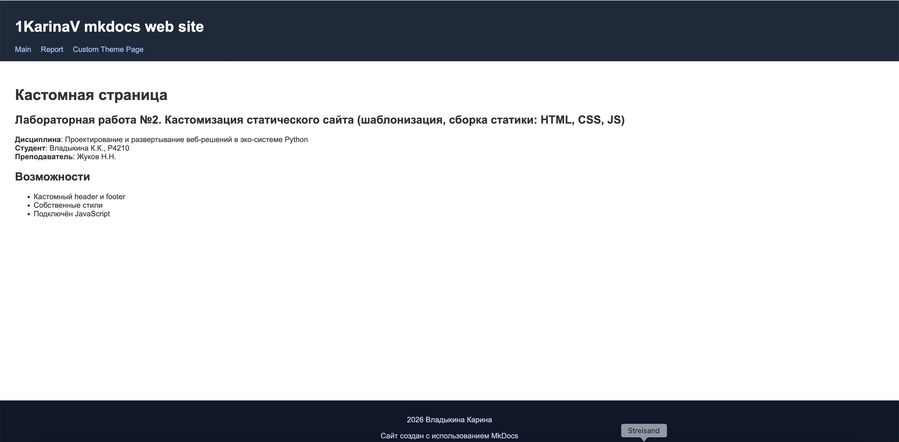

## Задание 2.2. Кастомизация статического сайта (шаблонизация, сборка статики: HTML, CSS, JS)
**Дисциплина**: Проектирование и развертывание веб-решений в эко-системе Python  
**Студент**: Владыкина К.К., P4210  
**Преподаватель**: Жуков Н.Н.

### Задание
На основе результатов выполнения предыдущей работы, кастомизируйте свой собственный сайт, разобравшись в том как возможно использовать свою собственную тему (шаблон для сайта) и создать свой шаблон (на занятии был продемонстрирован пример создания темы и шаблонизации с помощью Jinja2 для mkdocs), выполните сборку сайта с помощью GitHub Actions.   

### Выполнение
##### 1. Создание кастомной темы MkDocs
Для кастомизации внешнего вида сайта была разработана собственная тема MkDocs на основе HTML, CSS и JavaScript.
- Создан HTML-шаблон `theme/base.html`, в котором реализованы:
    - кастомный header с навигацией;
    - основной контейнер контента с использованием `{{ page.content }}` для интеграции Markdown;
    - кастомный footer;
    - подключение CSS и JavaScript;
    - метаданные сайта (title, description, author, viewport).

- Реализованы стили оформления в файле `theme/styles.css`
- Добавлен JavaScript-файл `theme/script.js` для подключения клиентской логики и демонстрации работы скриптов.


##### 2. Подключение кастомной темы к MkDocs
Для использования собственной темы была обновлена конфигурация MkDocs:
- стандартная тема (`readthedocs`) была отключена;
- в файле `mkdocs.yml` указана директория с кастомной темой:
```yaml
theme:
  name: null
  custom_dir: theme/
```

##### 3. Организация сборки фронтенда
Для сборки и оптимизации фронтенда был настроен процесс с использованием Node.js и npm.

В файле package.json определены следующие этапы сборки:
  - сборка и минификация CSS с помощью PostCSS, Autoprefixer и Cssnano;
  - минификация JavaScript с помощью Terser;
  - минификация HTML-файлов с помощью html-minifier;
  - общий сценарий сборки build, объединяющий все этапы.
```json
{
  "scripts": {
    "styles": "postcss theme/styles.css --use autoprefixer --use cssnano --no-map --output site/styles.css",
    "js": "terser theme/script.js -o theme/script.min.js",
    "html": "html-minifier --collapse-whitespace --remove-comments --input-dir site --output-dir site --file-ext html",
    "build": "npm run styles && npm run js && npm run html"
  }
}
```
Сборка выполняется следующей командой:
```bash
npm run build
```

##### 4. Реализация пайплайна тестирования фронтенда
Для проверки корректности сборки был создан отдельный workflow `test.yml`, который выполняется при push и pull request в ветку `main`.
```yaml
name: Test frontend

on:
  pull_request:
  push:
    branches:
      - main

jobs:
  frontend-test:
    runs-on: ubuntu-latest

    steps:
      - name: Checkout code
        uses: actions/checkout@v4

      - name: Setup Node.js
        uses: actions/setup-node@v4
        with:
          node-version: 20

      - name: Install dependencies
        run: npm ci

      - name: Build CSS
        run: npm run styles

      - name: Minify JS
        run: npm run js

      - name: Minify HTML
        run: |
          pip install mkdocs mkdocs-material
          mkdocs build
          npm run html
```

В рамках пайплайна:
  - устанавливаются зависимости Node.js;
  - выполняется сборка CSS;
  - минифицируется JavaScript;
  - выполняется сборка MkDocs для проверки генерации HTML.

##### 5. Реализация пайплайна сборки и деплоя
Для автоматического развертывания сайта был реализован workflow `deploy.yml`.
```yaml
name: Build & Deploy MkDocs with Frontend

permissions:
  contents: write

on:
  push:
    branches:
      - main

jobs:
  build_deploy:
    runs-on: ubuntu-latest

    steps:
      - name: Checkout code
        uses: actions/checkout@v4

      - name: Setup Python
        uses: actions/setup-python@v5
        with:
          python-version: '3.9'

      - name: Install MkDocs
        run: pip install mkdocs mkdocs-material

      - name: Build MkDocs site
        run: mkdocs build

      - name: Setup Node.js
        uses: actions/setup-node@v4
        with:
          node-version: 20

      - name: Install frontend dependencies
        run: npm ci

      - name: Build frontend (CSS, JS, HTML)
        run: npm run build

      - name: Deploy MkDocs site
        run: mkdocs gh-deploy --force
```
Пайплайн выполняет следующие шаги:
  1. клонирование репозитория;
  2. установка Python и MkDocs;
  3. сборка сайта из Markdown-файлов;
  4. установка Node.js и зависимостей фронтенда;
  5. сборка и минификация HTML, CSS и JavaScript;
  6. деплой сгенерированного сайта на GitHub Pages с помощью `mkdocs gh-deploy`.


Сайт доступен по [ссылке](https://1karinav.github.io/)
