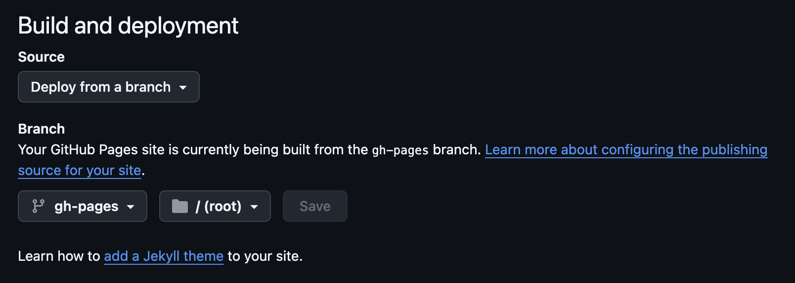

## Лабораторная работа №1. Создание и развертывание статического сайта
**Дисциплина**: Проектирование и развертывание веб-решений в эко-системе Python  
**Студент**: Владыкина К.К., P4210  
**Преподаватель**: Жуков Н.Н.

### Задание
Создать и развернуть на GitHub Pages  / свой собственный статический сайт используя MkDocs. <br> Автоматизировать процесс деплоя, разобраться с тем как деплоить именно на Pages.  

### Выполнение
1. Устанавливаем Python актуальной версии, проверяем работает ли pip (может запускаться из консоли по команде pip или pip3) и virtualenv.
```
brew install pip3
```

2. Устанавливаем virtualenv, если его нет: https://virtualenv.pypa.io/en/latest/installation.html.
```
python3 -m pip3 install --user virtualenv
```

3. Создаем каталог и там развертываем виртуальное окружение, активируем его.
```
virtualenv -p python3 env
```

4. Ставим mkdocs
```
pip3 install mkdocs
```

5. Пушим изменения в репозиторий. 
6. Настраиваем Actions.

В директории `.github/actions` был создан файл `mkdocs-deploy-action.yml`, который содержит необходимые шаги для генерации и деплоя сайта 

7. Создаем новый сервер или активируем аккаунт на Helios. 

Этап пропущен, тк использовался Github Actions


8. Корректируем yml-файл под место куда деплоим

В репозитории настраиваем ветку, с которой деплоим сайт:



9. Проверяем, что все задеплоилось. 

Сайт доступен по [ссылке](https://1karinav.github.io/)

### Вопросы:
<br>
1. Возможности использования отечественных CDN для ускорения доставки контента.  
На сегодняшний день основными провайдерами CDN в России выступают такие облачные вендоры как Yandex Cloud и Selectel.  
<details>
  <summary>Ответ</summary>
  На сегодняшний день основными провайдерами CDN в России выступают такие облачные вендоры как Yandex Cloud и Selectel.
Был проведен сравнительный анализ, результаты которого представлены в таблице:
<br>

| Функция/Параметр| **Yandex Cloud CDN** | **SelectelCDN**  |
|-----------------|----------------------|------------------|
| **Географическое покрытие** | Более 70 точек по всему миру, включая РФ | Широкая сеть в России|
| **Тип контента** | Статический контент (из Yandex Object Storage, виртуальных машин, ALB), включая РФ | Статический и динамический контент (включая потоковое видео и аудио)|
| **Методы доставки контента** | Кэширование на CDN-серверах, распределение нагрузки, управление временем жизни кэша | Кэширование, динамическая маршрутизация, управление трафиком, многопользовательский доступ |
| **Интеграция с объектным хранилищем** | Интеграция с Yandex Object Storage, поддержка CNAME для кастомных доменов | Интеграция с Selectel Storage, поддержка CNAME, наличие плагинов для CMS |
| **API и автоматизация** | Полный API, поддержка Terraform и CLI | API для работы с CDN, поддержка динамической маршрутизации |

**Вывод:** Yandex CDN лучше подходит в случаях, когда компания уже использует другие сервисы внутри Yandex Cloud. Selectel стоит выбрать в случае, если компания планирует размещать контект только на территории РФ.
</details>
<br>
2. Возможности Gitverse для реализации CI/CD.  
<details>
  <summary>Ответ</summary>
GitVerse оснащён встроенной системой автоматизации GitVerse Actions, которая позволяет организовать полный цикл CI/CD. Рабочие процессы описываются в YAML-файлах и могут запускаться по событиям репозитория (push, pull request, создание ветки и др.). Поддерживаются как облачные, так и self-hosted раннеры, что даёт гибкость в настройке окружений для сборки и тестирования. <br>
Система поддерживает работу с секретами, артефактами и пакетами (npm, PyPI, Docker, Maven и др.), что позволяет удобно хранить и распространять результаты сборки. GitVerse интегрирован с управлением версиями и релизами, а также включает элементы DevSecOps: статический анализ кода, проверку зависимостей и контроль качества. Это делает платформу полноценным инструментом для автоматизации процессов сборки, тестирования и доставки приложений.
</details>
<br>
3. Какие существуют варианты деплоя статического сайта в продакшен среду и какие технические инструменты для этого могут потребоваться, приведите примеры.
<details>
  <summary>Ответ</summary>
Развернуть статический сайт можно разными способами. Самый простой вариант — воспользоваться специализированными платформами вроде GitHub Pages, GitLab Pages, Netlify или Vercel: там всё настраивается за пару кликов, и сайт сразу получает HTTPS и CDN без лишних забот. Если нужен вариант с масштабируемостью и быстрой доставкой контента, то удобно использовать облачное хранилище в связке с CDN, например AWS S3 с CloudFront или Яндекс Object Storage. Более классический путь — разместить сайт на своём сервере и настроить веб-сервер (Nginx, Apache или Caddy), что требует чуть больше ручной работы, но даёт полный контроль. Для проектов, где используется контейнеризация, статический сайт можно упаковать в Docker и разворачивать через оркестраторы вроде Kubernetes. Чтобы не делать всё вручную, обычно подключают CI/CD (GitHub Actions, GitLab CI/CD, Jenkins и др.), а для ускорения и защиты трафика часто используют CDN-сервисы, например Cloudflare.
</details>